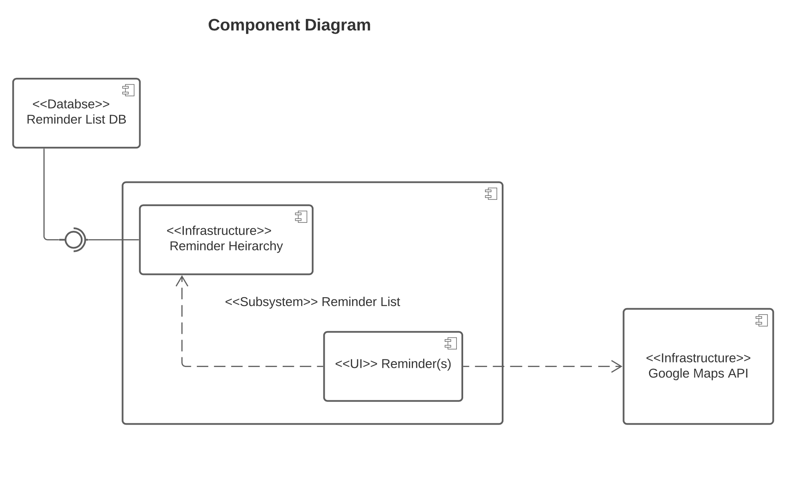

# Design Document

**Author**: Miss Prity Khatun

## 1 Design Considerations

### 1.1 Assumptions

It might be difficult to put everything into the database. Certain information might be lost when deleting a reminder and it might become hard to recover it. 

### 1.2 Constraints

One of the constraint that has a significant impact on the design of the system is that users must be able to add reminders to a list by picking them from a hierarchical list.

### 1.3 System Environment
Users can use this application using android samartphones which supports Pixel 4.

## 2 Architectural Design

### 2.1 Component Diagram

The Application Manager will require the database interface and as well as the Reminder List. There is a chance we will need only one class to represent the Reminder List, Reminder Hierarchy, and Reminder(s).

### 2.2 Deployment Diagram

The database will be server-side, so will the use of Google maps API. Client-side as shown, will contain the App Manager, List, Heirarchy, and Reminder on the device.

## 3 Low-Level Design

### 3.1 Class Diagram

### 3.2 Other Diagrams

The user creates a list object which goes through the database and sends back with an approval. Then the user can create reminder which goes through the database and google API, which then the reminder has been added to the list. 

## 4 User Interface Design

