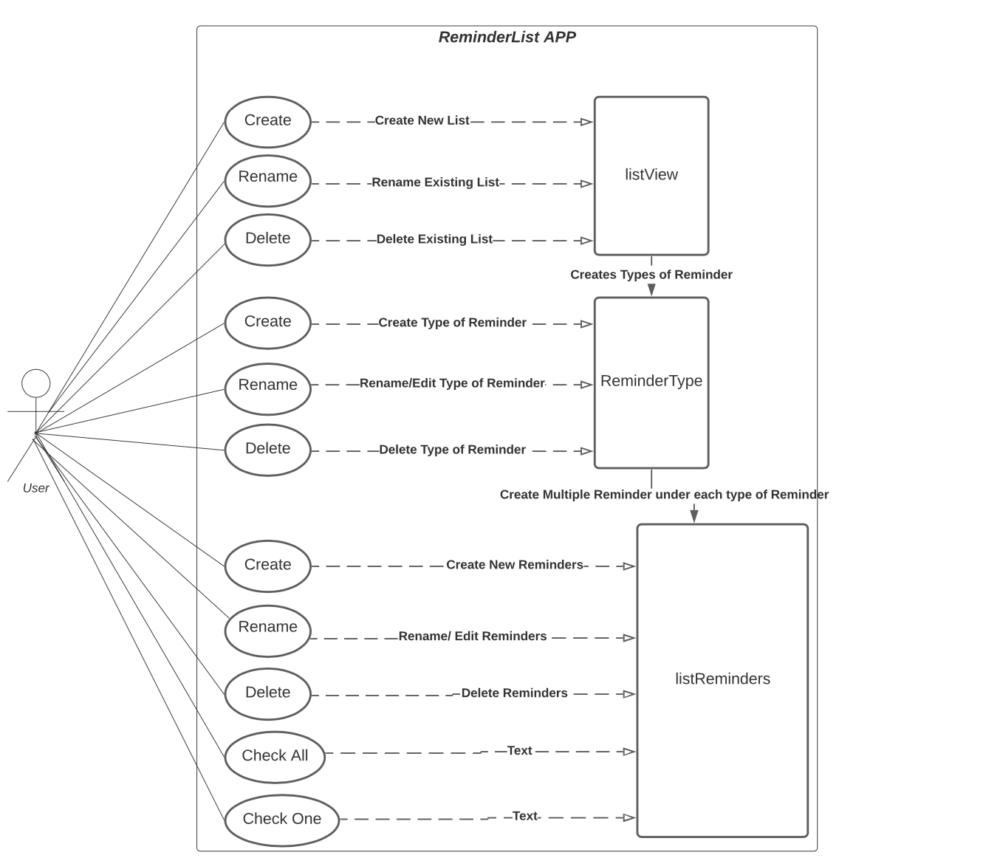

# Use Case Model

**Author**: Miss Prity Khatun

## 1 Use Case Diagram

## 2 Use Case Descriptions

*For each use case in the use case diagram, this section should contain a description, with the following elements:*

Requirements: Users must be able to add reminders to a list. Users must be able to create reminders which will remind them what they will need to do, they can create various lists of reminders. In each list the user will able to add the type of reminder it is such as meetings, appointments, events etc and also can write description of things they have to do.

Pre-conditions:
    Before the user add their reminders they must create a reminder list.
    Before they can add or create or delete their reminders they must create a reminder type inside of the reminder list.

Post-conditions:
    User can create many reminder list
    User can create different reminder types
    User can add their reminders under types of reminder

Scenarios: 

Normal: User first have to create a list to remind them. For example assuming the user creates a list for a work, they can name that list as work. In that specific list they can have types of reminders such as meetings, due date, things to do etc.

Alternate: User can create a list called "things to get done" in that specific list as one type of list in that list a user can set anything that they have to get done, which will work but not sorted out.

Exception: User naming the type of reminders and putting a reminder in side of a list sounds the same thing which can evtually create a confusion.